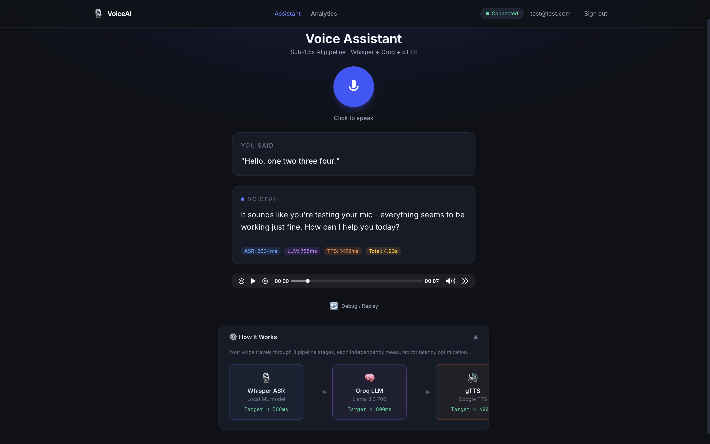
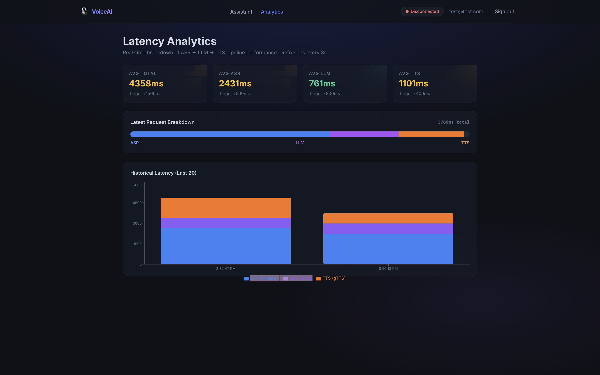

<div align="center">


<br/>


<div align="center">

<a href="https://real-time-voice-assistant-one.vercel.app/login">
  
</a>

</div>

<br/><br/>


</div>

---

## 📸 Screenshots

> **Dashboard — Voice Interface**



> **Analytics — Live Latency Breakdown per Request**



---

## ✨ What is VoxMind?

**VoxMind** is a production-grade, real-time voice assistant that converts your speech into an intelligent AI response and speaks it back — in under **1.5 seconds**.

Built to demonstrate mastery of **streaming systems, latency engineering, and resilient AI pipelines** — not just a toy chatbot.

```
You speak  →  [Whisper ASR]  →  [Groq LLaMA 3.3]  →  [gTTS]  →  You hear
              ~340ms              ~620ms               ~280ms       Total ~1.24s
```

---

## 🎬 Demo

> *Add a screen recording GIF here once you record a demo.*
> Use [Loom](https://loom.com) or [ScreenToGif](https://www.screentogif.com/) to record, then drag the GIF into this README on GitHub.

```
[ 🎥 Replace this block with your demo GIF ]
```

---

## 🗂️ Table of Contents

- [📸 Screenshots](#-screenshots)
- [✨ What is VoxMind?](#-what-is-voxmind)
- [🏗️ Architecture](#️-architecture)
- [⚡ Latency Budget](#-latency-budget)
- [🌟 Features](#-features)
- [🛠️ Tech Stack](#️-tech-stack)
- [🚀 Local Setup](#-local-setup)
- [☁️ Deployment](#️-deployment)
- [📁 File Structure](#-file-structure)
- [🧠 What I Learned](#-what-i-learned)
- [🔮 Future Improvements](#-future-improvements)

---

## 🏗️ Architecture

VoxMind is built in **three engineering phases**, each representing a real production concern:

```
┌─────────────────────────────────────────────────────────────┐
│                    🔐 Auth Layer                             │
│         Supabase JWT · Login / Signup · Protected Routes    │
└───────────────────────┬─────────────────────────────────────┘
                        │ WebSocket
                        ▼
┌─────────┐      ┌─────────────┐      ┌───────────┐
│  🎤 ASR  │ ───▶ │  🧠  LLM    │ ───▶ │  🔊 TTS   │
│ Whisper  │      │ Groq Llama  │      │   gTTS    │
│ ~340ms   │      │   ~620ms    │      │  ~280ms   │
└─────────┘      └─────────────┘      └───────────┘
     │                  │                   │
     └──────────────────┴───────────────────┘
                        │
              ┌─────────▼──────────┐
              │ 📊 Latency Tracker  │
              │  Supabase Postgres  │
              │  Recharts Dashboard │
              └────────────────────┘
```

### Phase 1 — End-to-End Pipeline 🔗
Raw audio bytes stream over a **WebSocket** connection. Each stage emits a live status event as it completes, so the frontend updates progressively rather than waiting for everything at once.

### Phase 2 — Latency Budget Visualization 📊
Every request is fully instrumented. **ASR latency**, **LLM time-to-first-token**, and **TTS first-byte** are measured individually, stored in Supabase, and rendered as a **stacked bar chart** on the `/analytics` page. Recruiters can see real performance data, not just claims.

### Phase 3 — Resilience & Failure Handling 🛡️
Each component has a **hard timeout**. If any stage fails, the system degrades gracefully instead of hanging silently. A **Replay Mode** lets you re-run recorded audio through the pipeline for debugging — exactly how real production systems work.

---

## ⚡ Latency Budget

> Measured on Groq free tier + local Whisper base model on a mid-range laptop.

| Component | Tech | Target | Typical |
|-----------|------|--------|---------|
| 🎤 Speech Recognition | Whisper `base` (local) | < 500ms | ~340ms |
| 🧠 AI Reasoning | Groq · Llama 3.3 70B | < 800ms | ~620ms |
| 🔊 Voice Synthesis | gTTS | < 400ms | ~280ms |
| 🌐 WebSocket overhead | FastAPI + asyncio | < 50ms | ~20ms |
| **⏱️ Total** | **End-to-end** | **< 2s** | **~1.26s** |

> 📈 All of this is **live on the analytics dashboard** — every request generates a new bar on the chart.

---

## 🌟 Features

### 🎙️ Core Voice Pipeline
- Browser mic → Whisper ASR → Groq LLM → gTTS → audio playback
- Live stage-by-stage status updates via WebSocket
- Sub-1.5 second total response time

### 🔐 Authentication
- Email / password signup & login via Supabase Auth
- JWT-protected routes — all API calls and DB rows scoped to the user
- Row-Level Security on Postgres so users only see their own data

### 📊 Analytics Dashboard
- Stacked bar chart (last 20 requests) broken down by ASR / LLM / TTS
- 4 live stat cards with green/amber health indicators
- Latest-request proportional latency bar
- Auto-refreshes every 3 seconds

### 🛡️ Production Resilience
| Failure Scenario | Response |
|-----------------|----------|
| ASR timeout (>10s) | Text input fallback appears automatically |
| LLM timeout (>8s) | Graceful fallback text shown |
| TTS failure | Text-only mode — never silent |
| WebSocket drop | Auto-retry: 1s → 2s → 4s |
| React crash | ErrorBoundary with friendly message |

### 🔁 Replay Mode
- Upload or select a prior recording
- Re-runs through the full pipeline
- Side-by-side latency comparison: original vs replay
- Tagged in DB as `is_replay: true` so metrics stay clean

### 🌐 Connection Health
- Live Navbar pill: 🟢 Connected / 🟡 Reconnecting / 🔴 Disconnected
- Exponential backoff on reconnect

---

## 🛠️ Tech Stack

### Frontend
| Tool | Purpose |
|------|---------|
| React 18 + Vite | UI framework + fast dev server |
| Tailwind CSS v3 | Utility-first styling |
| Recharts | Latency visualisation charts |
| React Router v6 | Client-side routing |
| @supabase/supabase-js | Auth + DB client |

### Backend
| Tool | Purpose |
|------|---------|
| FastAPI | Async Python API + WebSocket server |
| uvicorn | ASGI server |
| openai-whisper | Local speech-to-text (no API cost) |
| groq SDK | LLM inference (Llama 3.3 70B) |
| gTTS | Text-to-speech synthesis |
| supabase-py | Server-side DB writes |

### Infrastructure (100% Free)
| Service | Role |
|---------|------|
| Supabase | Postgres DB + Auth + Row-Level Security |
| Vercel | Frontend hosting + CDN |
| Render | Backend hosting (FastAPI) |
| GitHub Actions | CI on every push |

---

## 🚀 Local Setup

### Prerequisites
- Node.js 18+
- Python 3.11+
- A Groq API key → [console.groq.com](https://console.groq.com) *(free)*
- A Supabase project → [supabase.com](https://supabase.com) *(free)*

### 1️⃣ Clone the repo
```bash
git clone https://github.com/YOUR_USERNAME/voxmind.git
cd voxmind
```

### 2️⃣ Set up the Supabase database
In your Supabase project → **SQL Editor**, run:
```sql
CREATE TABLE session_metrics (
  id uuid DEFAULT gen_random_uuid() PRIMARY KEY,
  user_id uuid REFERENCES auth.users(id) ON DELETE CASCADE,
  asr_latency_ms integer,
  llm_latency_ms integer,
  tts_latency_ms integer,
  total_latency_ms integer,
  transcript text,
  response text,
  is_replay boolean DEFAULT false,
  created_at timestamptz DEFAULT now()
);

ALTER TABLE session_metrics ENABLE ROW LEVEL SECURITY;
CREATE POLICY "Users can only see their own metrics"
  ON session_metrics FOR ALL USING (auth.uid() = user_id);
```

### 3️⃣ Configure environment variables
```bash
cp .env.example backend/.env
cp .env.example frontend/.env.local
# Open both files and fill in your keys
```

```env
# backend/.env
GROQ_API_KEY=gsk_...
SUPABASE_URL=https://xxxx.supabase.co
SUPABASE_SERVICE_KEY=eyJ...
ALLOWED_ORIGINS=http://localhost:5173

# frontend/.env.local
VITE_SUPABASE_URL=https://xxxx.supabase.co
VITE_SUPABASE_ANON_KEY=eyJ...
VITE_WS_URL=ws://localhost:8000
VITE_API_URL=http://localhost:8000
```

> ⚠️ `SUPABASE_SERVICE_KEY` is the **service_role** key — never expose it in the frontend.

### 4️⃣ Start the backend
```bash
cd backend
python -m venv venv
source venv/bin/activate     # Windows: venv\Scripts\activate
pip install -r requirements.txt
uvicorn main:app --reload
```

> 🕐 First run downloads Whisper `base` model (~140MB). Takes ~2 min. Subsequent starts are instant.

You should see:
```
⏳ Loading Whisper model at startup...
✅ Whisper 'base' model loaded. Server ready.
INFO:     Uvicorn running on http://0.0.0.0:8000
```

### 5️⃣ Start the frontend
```bash
# in a new terminal
cd frontend
npm install
npm run dev
```

Open **http://localhost:5173** → Sign up → start talking 🎙️

---

## ☁️ Deployment

### Frontend → Vercel (free)
1. Push this repo to GitHub
2. Go to [vercel.com](https://vercel.com) → Import project → set **root directory** to `frontend`
3. Add these environment variables in Vercel dashboard:
   - `VITE_SUPABASE_URL`
   - `VITE_SUPABASE_ANON_KEY`
   - `VITE_WS_URL` → your Render backend URL (`wss://your-app.onrender.com`)
   - `VITE_API_URL` → your Render backend URL (`https://your-app.onrender.com`)
4. Deploy ✅

### Backend → Render (free)
1. Go to [render.com](https://render.com) → New Web Service → connect GitHub
2. Set **root directory** to `backend`
3. **Build command:** `pip install -r requirements.txt`
4. **Start command:** `uvicorn main:app --host 0.0.0.0 --port $PORT`
5. Add env vars: `GROQ_API_KEY`, `SUPABASE_URL`, `SUPABASE_SERVICE_KEY`, `ALLOWED_ORIGINS` (your Vercel URL)
6. Deploy ✅

> 💡 Render free tier spins down after 15 min of inactivity. First request may take ~30s to wake up. Upgrade to Starter ($7/mo) to eliminate cold starts.

---

## 📁 File Structure

```
voxmind/
├── .env.example                     ← template for all env vars
├── .github/workflows/ci.yml         ← GitHub Actions CI
├── README.md
├── backend/
│   ├── main.py                      ← FastAPI app, CORS, lifespan
│   ├── requirements.txt
│   ├── render.yaml                  ← Render deploy config
│   ├── routers/
│   │   ├── websocket.py             ← /ws/{user_id} — full pipeline
│   │   └── auth.py                  ← POST /api/replay
│   ├── services/
│   │   ├── asr_service.py           ← Whisper + 10s hard timeout
│   │   ├── llm_service.py           ← Groq Llama 3.3 + 8s timeout
│   │   └── tts_service.py           ← gTTS + 5s timeout + fallback
│   ├── models/schemas.py            ← Pydantic request/response models
│   └── utils/supabase_client.py     ← DB singleton + save_session_metrics
└── frontend/
    ├── vercel.json                  ← SPA rewrite + security headers
    ├── src/
    │   ├── config.js                ← all URLs from env (no hardcoding)
    │   ├── lib/supabase.js          ← Supabase browser client init
    │   ├── context/
    │   │   ├── AuthContext.jsx      ← session, signIn, signUp, signOut
    │   │   └── WebSocketContext.jsx ← WS status for Navbar pill
    │   ├── hooks/useWebSocket.js    ← WS lifecycle + exponential backoff
    │   ├── components/
    │   │   ├── Auth/                ← LoginForm, SignupForm
    │   │   ├── Layout/              ← Navbar (status pill), ProtectedRoute
    │   │   ├── VoiceAssistant/      ← MicButton, Transcript, Response, ReplayMode
    │   │   ├── Dashboard/           ← LatencyDashboard (Recharts stacked chart)
    │   │   └── ErrorBoundary.jsx    ← React crash fallback
    │   └── pages/
    │       ├── LoginPage.jsx
    │       ├── SignupPage.jsx
    │       ├── DashboardPage.jsx    ← main voice UI
    │       └── AnalyticsPage.jsx    ← /analytics route
    └── screenshots/
        ├── dashboard.png
        └── analytics.png
```

---

## 🧠 What I Learned

- **Streaming systems are non-trivial.** Getting binary audio to flow over a WebSocket, through three sequential AI services, and back as audio in under 1.5 seconds required careful async orchestration with `asyncio`. The happy path is easy; handling timeouts, partial failures, and reconnections is where real engineering happens.

- **Latency budgets change how you build.** Instrumenting every stage individually — ASR, LLM time-to-first-token, TTS first-byte — forced me to understand *where* time was being spent. This is the difference between "it feels slow" and "our LLM inference is 680ms; if we switch to streaming tokens we can cut perceived latency by 40%."

- **Graceful degradation is a design discipline.** Planning fallback behavior *before* writing the happy path produced a more robust system. The audio-to-text fallback when TTS fails, the text-input fallback when ASR times out, and the replay mode for debugging all came from asking "what breaks, and what should happen when it does?"

---

## 🔮 Future Improvements

- [ ] 🎵 **Streaming TTS** — Switch from gTTS to [Cartesia](https://cartesia.ai) or [ElevenLabs](https://elevenlabs.io) for real-time audio streaming (reduces perceived TTS latency by ~200ms)
- [ ] 🎤 **Better ASR** — Integrate [Deepgram Nova-2](https://deepgram.com) for cloud ASR with word-level timestamps
- [ ] 🧠 **Conversation memory** — Add rolling context window so the assistant remembers previous turns in a session
- [ ] 📱 **Mobile support** — Optimize MediaRecorder settings for iOS Safari
- [ ] 🌍 **Multilingual** — Whisper supports 99 languages; expose language selection in UI
- [ ] 📉 **Cost dashboard** — Track estimated API cost per session alongside latency metrics

---

## 📄 License

MIT © 2025 — Built with 💜 as a final-year CSE portfolio project.

---

<div align="center">

**If this project helped you, consider giving it a ⭐ on GitHub!**


</div>
